# 🗺️ Nova: Writers Conspiracy - Agent Workflow Diagrams

## Overview

This document details the intricate workflows of Nova's specialized AI agents, showing how they collaborate to create compelling narratives. Each agent has specific responsibilities and interacts with others through the Memory Service to maintain context and consistency.

## Agent Interaction Overview

## Detailed Agent Workflows

### 1. Project Manager Agent Workflow

**Key Responsibilities:**
- **Project Planning**: Break down user requirements into actionable tasks
- **Task Assignment**: Distribute work among specialized agents
- **Progress Monitoring**: Track completion status and quality
- **Quality Assurance**: Ensure output meets user expectations
- **User Communication**: Act as primary interface between user and agents

### 2. Researcher Agent Workflow

**Research Focus Areas:**
- **Historical Context**: Period-specific details and accuracy
- **Technical Information**: Scientific and technological facts
- **Cultural Elements**: Customs, traditions, and social structures
- **Geographic Data**: Location-specific details and descriptions
- **Genre Conventions**: Literary tropes and expectations

### 3. World Builder Agent Workflow

**World Building Components:**
- **Physical Geography**: Maps, climate, terrain, resources
- **Cultural Systems**: Languages, religions, customs, social hierarchies
- **Historical Timeline**: Past events, conflicts, technological evolution
- **Magic/Technology**: Rules, limitations, and consequences
- **Political Structures**: Governments, power dynamics, legal systems
- **Economic Systems**: Trade, currency, resources, class structures

### 4. Character Architect Agent Workflow

**Character Development Elements:**
- **Physical Description**: Appearance, mannerisms, distinguishing features
- **Personality Traits**: Core characteristics, motivations, fears
- **Background History**: Past experiences, family, education
- **Goals and Conflicts**: What they want, what stands in their way
- **Character Arc**: How they change throughout the story
- **Relationships**: Connections with other characters

### 5. Plot Alchemist Agent Workflow

**Plot Development Elements:**
- **Story Structure**: Three-act structure, hero's journey, etc.
- **Plot Points**: Major turning points and revelations
- **Scene Breakdown**: Individual scene purposes and outcomes
- **Conflict Progression**: Escalating challenges and resolutions
- **Pacing Management**: Rhythm of action and reflection
- **Subplot Integration**: Secondary storylines and themes

### 6. Writer Agent Workflow

**Writing Process Elements:**
- **Style Consistency**: Maintaining voice and tone throughout
- **Character Voice**: Distinct speech patterns and mannerisms
- **Scene Structure**: Opening, development, climax, resolution
- **Descriptive Detail**: Sensory details and atmospheric elements
- **Dialogue Crafting**: Natural speech patterns and subtext
- **Pacing Control**: Rhythm of action and reflection

### 7. Editor Agent Workflow

**Editing Focus Areas:**
- **Grammar and Mechanics**: Spelling, punctuation, sentence structure
- **Style Consistency**: Voice, tone, and narrative perspective
- **Content Clarity**: Clear communication of ideas and emotions
- **Flow and Rhythm**: Smooth transitions and pacing
- **Character Consistency**: Maintaining established traits and voices
- **World Consistency**: Adherence to established rules and details

### 8. Illustrator Agent Workflow

**Illustration Types:**
- **Character Portraits**: Individual character depictions
- **Scene Illustrations**: Key moments and settings
- **World Maps**: Geographic and political boundaries
- **Cover Art**: Book cover and promotional materials
- **Concept Art**: Design elements and visual concepts

## Memory Service Integration

### Context Sharing Workflow

**Marker Types:**
- `#location` - Geographic and setting information
- `@character` - Character-related content
- `!theme` - Thematic elements and motifs
- `note:` - General notes and observations
- `%plot` - Plot-related information
- `$world` - World-building details

## Quality Assurance Workflow

## Collaborative Decision Making

### Agent Consensus Workflow

## Error Handling and Recovery

### Agent Failure Recovery

## Performance Optimization

### Parallel Processing Workflow

**Optimization Strategies:**
- **Parallel Processing**: Independent tasks run simultaneously
- **Dependency Management**: Tasks that depend on others wait appropriately
- **Resource Allocation**: Distribute computational load efficiently
- **Caching**: Store frequently accessed data in memory
- **Batch Processing**: Group similar tasks for efficiency

---

*These workflow diagrams provide a comprehensive view of how Nova's AI agents collaborate to create compelling narratives while maintaining quality and consistency throughout the creative process.* 