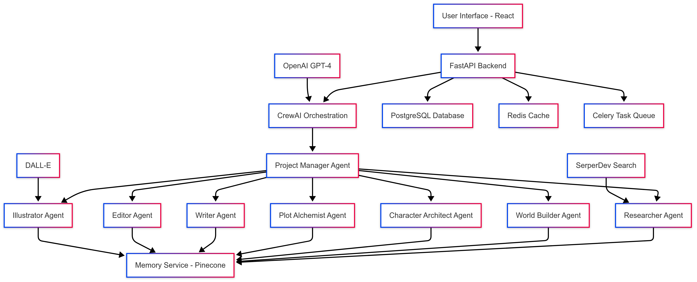

# 🏗️ Nova: Writers Conspiracy - System Architecture

## Overview

Nova is a sophisticated multi-agent system designed to assist writers in creating novels through collaborative AI agents. The architecture balances automated generation with deep user control, providing a seamless creative experience.

## System Architecture Diagram

(mermaid)
graph TD
    A[User Interface - React] --> B[FastAPI Backend]
    B --> C[CrewAI Orchestration]
    C --> D[Project Manager Agent]
    D --> E[Researcher Agent]
    D --> F[World Builder Agent]
    D --> G[Character Architect Agent]
    D --> H[Plot Alchemist Agent]
    D --> I[Writer Agent]
    D --> J[Editor Agent]
    D --> K[Illustrator Agent]
    
    E --> L[Memory Service - Pinecone]
    F --> L
    G --> L
    H --> L
    I --> L
    J --> L
    K --> L
    
    B --> M[PostgreSQL Database]
    B --> N[Redis Cache]
    B --> O[Celery Task Queue]
    
    P[OpenAI GPT-4] --> C
    Q[SerperDev Search] --> E
    R[DALL-E] --> K
```

## Core Components

### 1. Frontend Layer (React 18 + TypeScript)
- **Collaboration Dashboard**: Real-time project management interface
- **Agent Chat Interface**: Direct communication with AI agents
- **Manuscript Viewer**: Rich text editor with version control
- **World Bible**: Interactive world-building documentation
- **Character Profiles**: Dynamic character development tools

**Key Technologies:**
- React 18 with TypeScript
- Tailwind CSS for styling
- React Query for state management
- Socket.io for real-time updates
- React Router for navigation

### 2. Backend API Layer (FastAPI)
- **RESTful API**: Comprehensive endpoint coverage
- **Authentication**: JWT-based user management
- **Real-time Communication**: WebSocket support
- **File Management**: Document and asset handling

**Key Technologies:**
- FastAPI (Python 3.11+)
- SQLAlchemy ORM
- Alembic for migrations
- Pydantic for validation
- JWT authentication

### 3. Multi-Agent Orchestration (CrewAI)
- **Project Manager**: Central coordinator for all agents
- **Agent Specialization**: Each agent has specific creative roles
- **Memory Management**: Context-aware interactions
- **Workflow Orchestration**: Sequential and parallel task execution

### 4. Specialized AI Agents

#### Researcher Agent
- **Purpose**: Gather relevant information and research
- **Capabilities**: Web search, fact verification, source compilation
- **Tools**: SerperDev API, web scraping, citation management

#### World Builder Agent
- **Purpose**: Create detailed fictional worlds
- **Capabilities**: Geography, culture, history, magic systems
- **Output**: Structured world bible with interconnected elements

#### Character Architect Agent
- **Purpose**: Develop complex, consistent characters
- **Capabilities**: Personality development, backstory creation, relationship mapping
- **Output**: Character profiles with arcs and motivations

#### Plot Alchemist Agent
- **Purpose**: Structure compelling narrative plots
- **Capabilities**: Story structure, conflict creation, pacing management
- **Output**: Detailed plot outlines with scene breakdowns

#### Writer Agent
- **Purpose**: Generate actual manuscript content
- **Capabilities**: Scene writing, dialogue creation, descriptive prose
- **Output**: Chapter drafts with consistent voice and style

#### Editor Agent
- **Purpose**: Refine and polish generated content
- **Capabilities**: Grammar checking, style consistency, pacing optimization
- **Output**: Polished manuscript sections

#### Illustrator Agent
- **Purpose**: Create visual content for the story
- **Capabilities**: Character illustrations, scene depictions, cover art
- **Tools**: DALL-E integration, image generation

### 5. Memory Service (Pinecone)
- **Purpose**: Context-aware information storage and retrieval
- **Features**: Marker-indexed content, semantic search, version control
- **Integration**: All agents read/write to shared memory

### 6. Data Layer
- **PostgreSQL**: Structured data storage (users, projects, metadata)
- **Redis**: Caching and session management
- **Celery**: Asynchronous task processing

## Data Flow Architecture

### 1. Project Creation Flow
```
User Input → Project Manager → Research Assignment → World Building → Character Development → Plot Creation → Writing → Editing → User Review
```

### 2. Memory Management Flow
```
Agent Output → Marker Extraction → Pinecone Indexing → Context Retrieval → Agent Input
```

### 3. Real-time Collaboration Flow
```
User Action → WebSocket → Backend → Agent Processing → Memory Update → UI Update
```

## Security Architecture

### Authentication & Authorization
- JWT-based authentication
- Role-based access control
- API rate limiting
- Secure WebSocket connections

### Data Protection
- Encrypted data transmission
- Secure API key management
- GDPR-compliant data handling
- Regular security audits

## Scalability Considerations

### Horizontal Scaling
- Stateless API design
- Load balancer support
- Database connection pooling
- Redis clustering for high availability

### Performance Optimization
- Caching strategies (Redis)
- Database query optimization
- CDN for static assets
- Asynchronous processing (Celery)

## Deployment Architecture

### Containerization
- Docker containers for all services
- Docker Compose for local development
- Kubernetes-ready for production

### Environment Management
- Environment-specific configurations
- Secret management
- Health check endpoints
- Monitoring and logging

## Integration Points

### External APIs
- **OpenAI GPT-4**: Primary LLM for content generation
- **Pinecone**: Vector database for memory management
- **SerperDev**: Web search capabilities
- **DALL-E**: Image generation for illustrations

### Third-party Services
- **Auth0**: User authentication (optional)
- **Pusher**: Real-time notifications
- **Cloud Storage**: Document and asset storage

## Monitoring & Observability

### Application Monitoring
- Request/response logging
- Error tracking and alerting
- Performance metrics collection
- User behavior analytics

### System Health
- Service health checks
- Database connection monitoring
- Queue processing metrics
- Memory usage tracking

## Future Architecture Considerations

### Planned Enhancements
- **Microservices Migration**: Breaking down monolithic backend
- **Event Sourcing**: For better audit trails
- **GraphQL API**: For more flexible data queries
- **Edge Computing**: For reduced latency
- **AI Model Fine-tuning**: Custom models for specific genres

### Scalability Roadmap
- **Multi-region Deployment**: Global availability
- **Auto-scaling**: Dynamic resource allocation
- **Advanced Caching**: Multi-layer caching strategy
- **Real-time Analytics**: Live user behavior tracking

---

*This architecture document serves as the foundation for the Nova Writers Conspiracy platform, ensuring scalability, maintainability, and creative flexibility.* 