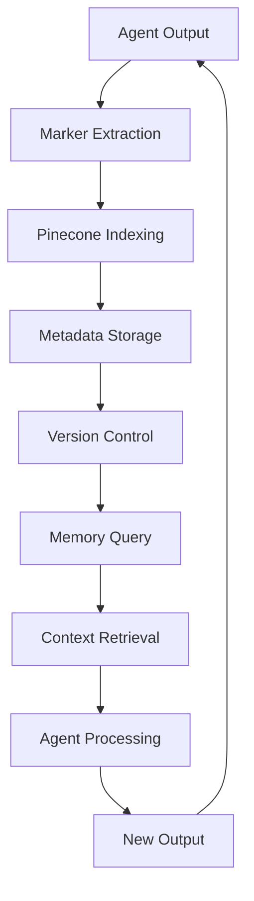

# 🧠 Nova: Writers Conspiracy - Memory Service Documentation

## Overview

The Memory Service is the central nervous system of Nova's multi-agent architecture. It provides marker-indexed context handling that enables agents to share information, maintain consistency, and build upon each other's work through a sophisticated semantic memory system.

## Core Concepts

### Marker-Indexed Memory
Instead of storing raw text, the Memory Service uses semantic markers to categorize and index content. This allows for precise retrieval of relevant context without overwhelming agents with irrelevant information.

### Memory Shards
Agents can work in isolated "shards" of memory, allowing for specialized workflows while still maintaining access to shared context when needed.

### Version Control
All memory entries are versioned, enabling agents to track changes and maintain audit trails of creative decisions.

## Architecture Diagram



## Marker System

### Marker Types and Conventions

| Marker | Type | Description | Example |
|--------|------|-------------|---------|
| `#location` | Geographic | Places, settings, environments | `#location:NewYork` |
| `@character` | Character | Character names, traits, actions | `@character:JohnDoe` |
| `!theme` | Thematic | Themes, motifs, symbols | `!theme:redemption` |
| `%plot` | Plot | Plot points, story structure | `%plot:climax` |
| `$world` | World-building | World details, rules, systems | `$world:magic` |
| `note:` | General | Notes, observations, comments | `note:important` |

### Marker Extraction Patterns

```typescript
// Example marker extraction from text
const text = "John walked through the bustling streets of New York, thinking about redemption.";
const markers = [
  { type: "character", value: "John" },
  { type: "location", value: "New York" },
  { type: "theme", value: "redemption" }
];
```

## Memory Service Implementation

### Core Interfaces

```typescript
interface MemoryMarker {
  id: string;
  type: string;
  value: string;
  agent?: string;
  timestamp: string;
  version?: number;
  archived?: boolean;
}

interface MemoryEntry {
  id: string;
  content: string;
  markers: MemoryMarker[];
  createdAt: string;
  updatedAt?: string;
  version?: number;
  agent?: string;
  shard?: string;
}

interface MemoryQuery {
  markers: Partial<MemoryMarker>[];
  agent?: string;
  shard?: string;
  limit?: number;
  includeArchived?: boolean;
}
```

### Memory Service Class

```typescript
class MemoryService {
  private pineconeClient: PineconeClient;
  private database: Database;

  constructor(pineconeClient: PineconeClient, database: Database) {
    this.pineconeClient = pineconeClient;
    this.database = database;
  }

  // Write new memory entry
  async writeMemory(entry: Omit<MemoryEntry, 'id' | 'createdAt'>): Promise<MemoryEntry> {
    const memoryEntry: MemoryEntry = {
      id: generateId(),
      content: entry.content,
      markers: entry.markers,
      createdAt: new Date().toISOString(),
      version: entry.version || 1,
      agent: entry.agent,
      shard: entry.shard
    };

    // Store in database
    await this.database.memories.create(memoryEntry);

    // Index in Pinecone
    await this.indexInPinecone(memoryEntry);

    return memoryEntry;
  }

  // Query memory with marker-based filtering
  async queryMemory(query: MemoryQuery): Promise<MemoryEntry[]> {
    const { markers, agent, shard, limit = 50, includeArchived = false } = query;

    // Build database query
    const dbQuery = this.buildDatabaseQuery(markers, agent, shard, includeArchived);
    const dbResults = await this.database.memories.findMany(dbQuery);

    // Enhance with Pinecone similarity search
    const pineconeResults = await this.searchPinecone(markers, limit);
    
    // Merge and rank results
    return this.mergeAndRankResults(dbResults, pineconeResults, limit);
  }

  // Update existing memory entry
  async updateMemory(id: string, updates: Partial<MemoryEntry>): Promise<MemoryEntry> {
    const existing = await this.database.memories.findUnique({ where: { id } });
    if (!existing) throw new Error('Memory entry not found');

    const updated: MemoryEntry = {
      ...existing,
      ...updates,
      version: (existing.version || 1) + 1,
      updatedAt: new Date().toISOString()
    };

    await this.database.memories.update({ where: { id }, data: updated });
    await this.updatePineconeIndex(updated);

    return updated;
  }

  // Soft delete memory entry
  async archiveMemory(id: string): Promise<void> {
    await this.database.memories.update({
      where: { id },
      data: { archived: true, updatedAt: new Date().toISOString() }
    });
  }

  // Get memory entry history
  async getMemoryHistory(id: string): Promise<MemoryEntry[]> {
    return this.database.memories.findMany({
      where: { id },
      orderBy: { version: 'desc' }
    });
  }
}
```

## Agent Integration

### AgentBase Integration

```typescript
export abstract class AgentBase {
  protected config: AgentConfig;
  protected memoryService: MemoryService;

  constructor(config: AgentConfig, memoryService: MemoryService) {
    this.config = config;
    this.memoryService = memoryService;
  }

  // Retrieve relevant context for this agent and task
  protected async getContext(task: AgentTask): Promise<MemoryEntry[]> {
    const markers = task.markers || [];
    const entries = await this.memoryService.queryMemory({
      markers,
      agent: this.config.shard,
      limit: this.config.contextWindow
    });
    
    return entries;
  }

  // Write agent output to memory
  protected async writeMemory(content: string, markers: MemoryMarker[]): Promise<MemoryEntry> {
    return this.memoryService.writeMemory({
      content,
      markers,
      agent: this.config.id,
      shard: this.config.shard
    });
  }
}
```

## Usage Patterns

### 1. World Builder Agent Example

```typescript
class WorldBuilderAgent extends AgentBase {
  async handleTask(task: AgentTask, context: MemoryEntry[]): Promise<any> {
    // Retrieve world-building context
    const worldContext = await this.memoryService.queryMemory({
      markers: [{ type: 'world', value: '*' }],
      agent: this.config.shard
    });

    // Generate world details
    const worldDetails = await this.generateWorldDetails(task.input, worldContext);

    // Write to memory with appropriate markers
    await this.writeMemory(worldDetails.content, [
      { type: 'world', value: 'geography' },
      { type: 'world', value: 'culture' },
      { type: 'location', value: worldDetails.location }
    ]);

    return worldDetails;
  }
}
```

### 2. Character Architect Agent Example

```typescript
class CharacterArchitectAgent extends AgentBase {
  async handleTask(task: AgentTask, context: MemoryEntry[]): Promise<any> {
    // Retrieve character and world context
    const characterContext = await this.memoryService.queryMemory({
      markers: [
        { type: 'character', value: '*' },
        { type: 'world', value: '*' }
      ],
      agent: this.config.shard
    });

    // Generate character profile
    const characterProfile = await this.generateCharacterProfile(task.input, characterContext);

    // Write to memory with character markers
    await this.writeMemory(characterProfile.content, [
      { type: 'character', value: characterProfile.name },
      { type: 'character', value: 'protagonist' },
      { type: 'plot', value: 'character_arc' }
    ]);

    return characterProfile;
  }
}
```

### 3. Writer Agent Example

```typescript
class WriterAgent extends AgentBase {
  async handleTask(task: AgentTask, context: MemoryEntry[]): Promise<any> {
    // Retrieve comprehensive context
    const writingContext = await this.memoryService.queryMemory({
      markers: [
        { type: 'character', value: '*' },
        { type: 'plot', value: '*' },
        { type: 'world', value: '*' },
        { type: 'location', value: '*' }
      ],
      agent: this.config.shard
    });

    // Generate scene content
    const sceneContent = await this.generateScene(task.input, writingContext);

    // Write to memory with scene markers
    await this.writeMemory(sceneContent.text, [
      { type: 'plot', value: 'scene' },
      { type: 'character', value: sceneContent.characters.join(',') },
      { type: 'location', value: sceneContent.location }
    ]);

    return sceneContent;
  }
}
```

## Advanced Features

### 1. Memory Sharding

```typescript
// Agent-specific memory shard
const researcherMemory = await memoryService.queryMemory({
  markers: [{ type: 'research', value: '*' }],
  shard: 'researcher'
});

// Shared memory across all agents
const sharedMemory = await memoryService.queryMemory({
  markers: [{ type: 'world', value: '*' }],
  shard: 'shared'
});
```

### 2. Complex Queries

```typescript
// Find all content related to a specific character in a specific location
const characterInLocation = await memoryService.queryMemory({
  markers: [
    { type: 'character', value: 'John' },
    { type: 'location', value: 'New York' }
  ]
});

// Find all thematic content related to redemption
const redemptionThemes = await memoryService.queryMemory({
  markers: [{ type: 'theme', value: 'redemption' }]
});
```

### 3. Memory Versioning

```typescript
// Get the latest version of a memory entry
const latest = await memoryService.queryMemory({
  markers: [{ type: 'character', value: 'John' }]
});

// Get the history of changes
const history = await memoryService.getMemoryHistory(entryId);
```

## Performance Optimization

### 1. Caching Strategy

```typescript
class CachedMemoryService extends MemoryService {
  private cache = new Map<string, MemoryEntry[]>();

  async queryMemory(query: MemoryQuery): Promise<MemoryEntry[]> {
    const cacheKey = this.generateCacheKey(query);
    
    if (this.cache.has(cacheKey)) {
      return this.cache.get(cacheKey)!;
    }

    const results = await super.queryMemory(query);
    this.cache.set(cacheKey, results);
    
    return results;
  }
}
```

### 2. Batch Operations

```typescript
// Batch write multiple memory entries
async batchWriteMemory(entries: Omit<MemoryEntry, 'id' | 'createdAt'>[]): Promise<MemoryEntry[]> {
  const memoryEntries = entries.map(entry => ({
    ...entry,
    id: generateId(),
    createdAt: new Date().toISOString()
  }));

  await this.database.memories.createMany({ data: memoryEntries });
  await this.batchIndexInPinecone(memoryEntries);

  return memoryEntries;
}
```

## Error Handling

### 1. Memory Service Errors

```typescript
class MemoryServiceError extends Error {
  constructor(message: string, public code: string, public details?: any) {
    super(message);
    this.name = 'MemoryServiceError';
  }
}

// Handle memory service errors
try {
  await memoryService.writeMemory(entry);
} catch (error) {
  if (error instanceof MemoryServiceError) {
    console.error(`Memory service error: ${error.code} - ${error.message}`);
    // Implement retry logic or fallback
  }
}
```

### 2. Recovery Mechanisms

```typescript
class ResilientMemoryService extends MemoryService {
  async writeMemory(entry: Omit<MemoryEntry, 'id' | 'createdAt'>): Promise<MemoryEntry> {
    try {
      return await super.writeMemory(entry);
    } catch (error) {
      // Fallback to local storage
      return this.writeToLocalStorage(entry);
    }
  }
}
```

## Monitoring and Analytics

### 1. Memory Usage Metrics

```typescript
interface MemoryMetrics {
  totalEntries: number;
  activeEntries: number;
  archivedEntries: number;
  averageMarkersPerEntry: number;
  mostUsedMarkers: Array<{ marker: string; count: number }>;
  agentUsage: Array<{ agent: string; entries: number }>;
}

async getMemoryMetrics(): Promise<MemoryMetrics> {
  // Implementation for collecting memory usage statistics
}
```

### 2. Performance Monitoring

```typescript
class MonitoredMemoryService extends MemoryService {
  async queryMemory(query: MemoryQuery): Promise<MemoryEntry[]> {
    const startTime = Date.now();
    
    try {
      const results = await super.queryMemory(query);
      this.recordMetric('query_time', Date.now() - startTime);
      this.recordMetric('query_results', results.length);
      return results;
    } catch (error) {
      this.recordMetric('query_errors', 1);
      throw error;
    }
  }
}
```

## Best Practices

### 1. Marker Naming Conventions
- Use consistent, descriptive marker values
- Avoid overly specific markers that limit reuse
- Use wildcards (`*`) for broad queries
- Group related markers with prefixes

### 2. Memory Management
- Regularly archive old or unused entries
- Monitor memory usage and performance
- Implement cleanup strategies for large datasets
- Use versioning for important changes

### 3. Agent Integration
- Always use markers when writing to memory
- Query only relevant context to avoid noise
- Implement proper error handling
- Use sharding for agent-specific workflows

### 4. Performance Considerations
- Cache frequently accessed memory entries
- Use batch operations for multiple writes
- Implement connection pooling for database access
- Monitor query performance and optimize as needed

---

*The Memory Service is the foundation of Nova's collaborative intelligence, enabling agents to work together seamlessly while maintaining context and consistency throughout the creative process.* 