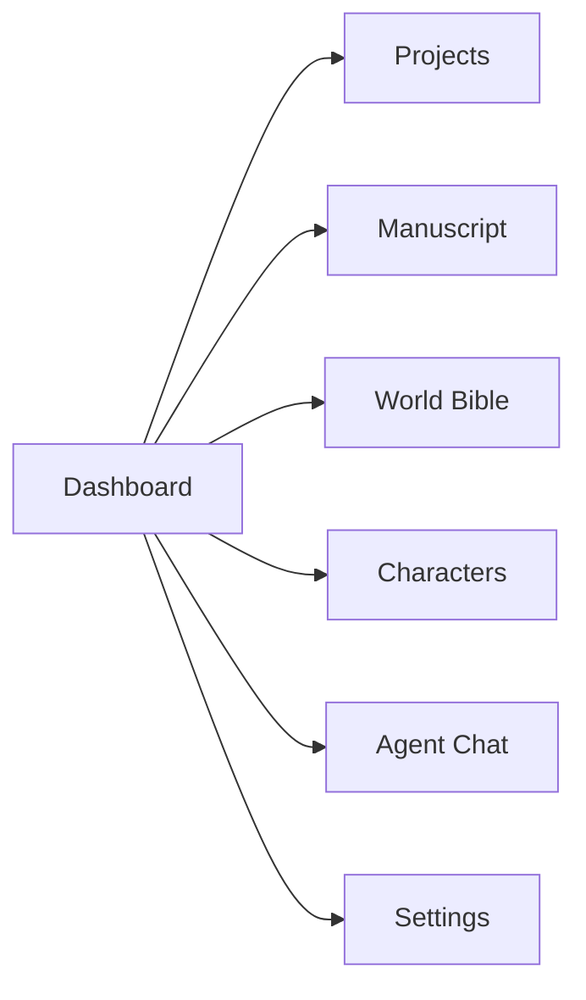
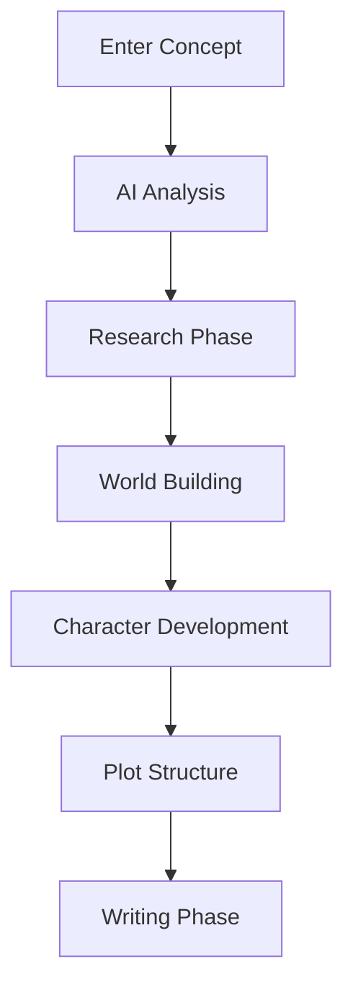

# 📖 Nova: Writers Conspiracy - User Guide

## Welcome to Nova

Nova is a revolutionary collaborative writing platform that brings together human creativity and AI intelligence to create compelling novels. This guide will help you navigate the platform and make the most of your collaborative writing experience.

## Getting Started

### 1. Creating Your Account

1. **Visit the Platform**: Navigate to [nova-writers.com](https://nova-writers.com)
2. **Sign Up**: Click "Get Started" and create your account
3. **Complete Profile**: Add your writing preferences and experience level
4. **Choose Collaboration Level**: Select your preferred level of AI involvement

### 2. Understanding Collaboration Levels

Nova offers four levels of collaboration to suit different writing styles:

#### **Level 1: Research Assistant**
- AI helps with research and fact-checking
- Minimal creative input
- You maintain full creative control

#### **Level 2: World Builder**
- AI assists with world-building and character development
- Provides suggestions for plot structure
- You make final creative decisions

#### **Level 3: Co-Writer**
- AI actively contributes to story development
- Collaborative plot and character creation
- Shared creative responsibility

#### **Level 4: Creative Partner**
- Full AI collaboration across all aspects
- AI generates content for your review
- You guide and refine the creative process

## Dashboard Overview

### Main Navigation



### Dashboard Components

1. **Project Overview**: Quick stats and progress indicators
2. **Recent Activity**: Latest updates from AI agents
3. **Quick Actions**: Common tasks and shortcuts
4. **Agent Status**: Current agent activities and availability

## Creating Your First Project

### Step 1: Project Setup

1. **Click "New Project"** from the dashboard
2. **Enter Project Details**:
   - **Title**: Your novel's working title
   - **Description**: Brief synopsis or concept
   - **Genre**: Select from available genres
   - **Tone**: Choose the desired emotional tone
   - **Collaboration Level**: Select your preferred AI involvement

### Step 2: Initial Concept Development



### Step 3: AI Agent Introduction

After creating your project, Nova will introduce you to your AI collaborators:

- **Project Manager**: Coordinates all agents and manages workflow
- **Researcher**: Gathers information and fact-checks
- **World Builder**: Creates detailed fictional worlds
- **Character Architect**: Develops complex characters
- **Plot Alchemist**: Structures compelling narratives
- **Writer**: Generates prose and dialogue
- **Editor**: Refines and polishes content
- **Illustrator**: Creates visual content

## Working with AI Agents

### Agent Chat Interface

The Agent Chat is your primary communication hub with AI agents.

#### Starting a Conversation

1. **Select an Agent**: Choose from the available AI agents
2. **Describe Your Request**: Be specific about what you need
3. **Review Response**: AI will provide detailed responses
4. **Iterate**: Ask follow-up questions or request revisions

#### Example Conversations

**With the Researcher Agent:**
```
You: "I need information about medieval castle architecture for my fantasy novel."

Researcher: "I'll research medieval castle architecture and provide you with:
- Common architectural features
- Construction techniques
- Historical examples
- Fantasy adaptations

Would you like me to focus on any specific aspect?"
```

**With the Character Architect:**
```
You: "I need a compelling antagonist for my sci-fi novel about space exploration."

Character Architect: "I'll create a complex antagonist with:
- Motivations and backstory
- Personality traits and flaws
- Relationship to protagonist
- Character arc development

What type of antagonist would work best for your story?"
```

### Agent Commands

Use these commands for quick interactions:

- `/research [topic]` - Request research on a specific topic
- `/world [element]` - Ask about world-building elements
- `/character [name]` - Discuss character development
- `/plot [scene]` - Get help with plot structure
- `/write [scene]` - Request content generation
- `/edit [content]` - Ask for editing suggestions
- `/illustrate [description]` - Request visual content

## Manuscript Management

### Viewing Your Manuscript

1. **Navigate to Manuscript**: Click "Manuscript" in the main navigation
2. **Chapter View**: Browse chapters and scenes
3. **Version History**: View previous versions and changes
4. **Collaborative Comments**: See AI and human feedback

### Editing and Revising

#### Manual Editing
1. **Select Text**: Click on any section to edit
2. **Make Changes**: Use the rich text editor
3. **Save Changes**: Auto-saves as you type
4. **Request AI Review**: Ask agents to review your changes

#### AI-Assisted Editing
1. **Highlight Text**: Select content for AI review
2. **Choose Agent**: Select Writer or Editor agent
3. **Request Feedback**: Ask for specific improvements
4. **Apply Suggestions**: Review and accept AI suggestions

### Version Control

- **Auto-Save**: Changes are automatically saved
- **Version History**: Access previous versions
- **Compare Changes**: See differences between versions
- **Restore**: Revert to previous versions if needed

## World Building

### World Bible

The World Bible is your comprehensive guide to your fictional world.

#### Creating World Elements

1. **Geography**: Maps, climate, terrain
2. **Culture**: Languages, customs, religions
3. **History**: Timeline of events and conflicts
4. **Magic/Technology**: Rules and limitations
5. **Politics**: Governments and power structures

#### AI-Assisted World Building

**Example World Building Session:**
```
You: "I need a magic system for my fantasy world."

World Builder: "I'll help you create a comprehensive magic system:
- Source of magic power
- Rules and limitations
- Different types of magic
- Consequences of use
- Social implications

What type of magic system interests you most?"
```

### Character Development

#### Character Profiles

Each character has a detailed profile including:

- **Physical Description**: Appearance and mannerisms
- **Personality Traits**: Core characteristics and motivations
- **Background History**: Past experiences and relationships
- **Character Arc**: Development throughout the story
- **Relationships**: Connections with other characters

#### AI Character Development

**Example Character Session:**
```
You: "I need a complex protagonist for my mystery novel."

Character Architect: "I'll create a compelling protagonist with:
- Unique personality traits
- Personal conflicts and goals
- Relevant background and skills
- Character growth arc
- Relationships with other characters

What type of protagonist would work best for your mystery?"
```

## Plot Development

### Plot Structure

Nova helps you develop compelling plot structures:

1. **Three-Act Structure**: Setup, confrontation, resolution
2. **Hero's Journey**: Classic storytelling framework
3. **Plot Points**: Major turning points and revelations
4. **Subplots**: Secondary storylines and themes
5. **Pacing**: Rhythm of action and reflection

### AI Plot Assistance

**Example Plot Session:**
```
You: "I need help structuring the climax of my thriller."

Plot Alchemist: "I'll help you create a compelling climax:
- Build tension and suspense
- Reveal key information
- Create satisfying resolution
- Tie up loose ends
- Set up potential sequels

What elements are most important for your climax?"
```

## Collaboration Features

### Real-Time Collaboration

- **Live Updates**: See changes as they happen
- **Agent Status**: Monitor AI agent activities
- **Progress Tracking**: Track project milestones
- **Notifications**: Get alerts for important updates

### Feedback and Review

#### AI Feedback
- **Content Quality**: Grammar, style, and clarity
- **Consistency**: Character and world consistency
- **Pacing**: Story rhythm and flow
- **Thematic Elements**: Theme development and symbolism

#### Human Review
- **Accept Changes**: Approve AI suggestions
- **Request Revisions**: Ask for specific changes
- **Provide Feedback**: Give detailed notes to AI
- **Collaborative Editing**: Work together on content

## Advanced Features

### Custom Agent Instructions

You can customize AI agent behavior:

1. **Writing Style**: Specify preferred tone and voice
2. **Genre Conventions**: Set genre-specific guidelines
3. **Character Voices**: Define distinct speech patterns
4. **World Rules**: Establish consistent world-building rules

### Memory and Context

Nova maintains context across sessions:

- **Project Memory**: Agents remember project details
- **Character Consistency**: Maintain character traits
- **World Continuity**: Ensure world-building consistency
- **Plot Coherence**: Track story development

### Export and Publishing

#### Export Options
- **Word Document**: Standard manuscript format
- **PDF**: Print-ready format
- **EPUB**: E-book format
- **Markdown**: Plain text with formatting

#### Publishing Preparation
- **Formatting**: Professional manuscript formatting
- **Cover Design**: AI-generated cover concepts
- **Blurb Writing**: Marketing copy assistance
- **Genre Classification**: Proper categorization

## Best Practices

### Effective Collaboration

1. **Be Specific**: Give clear, detailed instructions to AI agents
2. **Review Regularly**: Check AI-generated content for quality
3. **Provide Feedback**: Help AI learn your preferences
4. **Maintain Control**: You're the creative director

### Writing Workflow

#### Recommended Process
1. **Concept Development**: Start with a clear vision
2. **Research Phase**: Gather necessary information
3. **World Building**: Create your fictional universe
4. **Character Development**: Develop compelling characters
5. **Plot Structure**: Plan your story arc
6. **Writing Phase**: Generate and refine content
7. **Editing Phase**: Polish and perfect
8. **Review Phase**: Final review and preparation

### Quality Control

#### Content Review Checklist
- [ ] Grammar and spelling
- [ ] Character consistency
- [ ] World-building coherence
- [ ] Plot logic and flow
- [ ] Thematic development
- [ ] Pacing and rhythm
- [ ] Dialogue quality
- [ ] Descriptive elements

## Troubleshooting

### Common Issues

#### AI Agent Not Responding
1. **Check Connection**: Ensure stable internet connection
2. **Refresh Page**: Reload the application
3. **Clear Cache**: Clear browser cache and cookies
4. **Contact Support**: If issues persist

#### Content Quality Issues
1. **Provide More Context**: Give AI more background information
2. **Be More Specific**: Clarify your requirements
3. **Request Revisions**: Ask for specific improvements
4. **Adjust Collaboration Level**: Consider changing AI involvement

#### Performance Issues
1. **Close Other Tabs**: Reduce browser memory usage
2. **Check Internet Speed**: Ensure stable connection
3. **Clear Browser Data**: Remove cached files
4. **Try Different Browser**: Switch to alternative browser

### Getting Help

#### Support Resources
- **Help Center**: Comprehensive documentation
- **Video Tutorials**: Step-by-step guides
- **Community Forum**: Connect with other writers
- **Live Chat**: Real-time support
- **Email Support**: Detailed assistance

#### Contact Information
- **Email**: support@nova-writers.com
- **Discord**: Join our community server
- **Twitter**: @NovaWritersAI
- **Documentation**: docs.nova-writers.com

## Keyboard Shortcuts

### Navigation
- `Ctrl/Cmd + 1`: Dashboard
- `Ctrl/Cmd + 2`: Manuscript
- `Ctrl/Cmd + 3`: World Bible
- `Ctrl/Cmd + 4`: Characters
- `Ctrl/Cmd + 5`: Agent Chat

### Editing
- `Ctrl/Cmd + S`: Save
- `Ctrl/Cmd + Z`: Undo
- `Ctrl/Cmd + Y`: Redo
- `Ctrl/Cmd + F`: Find
- `Ctrl/Cmd + H`: Replace

### Agent Commands
- `Ctrl/Cmd + /`: Open agent command palette
- `Ctrl/Cmd + Enter`: Send message to agent
- `Ctrl/Cmd + Shift + A`: Add new agent
- `Ctrl/Cmd + Shift + M`: Open memory view

## Privacy and Security

### Data Protection
- **Encryption**: All data is encrypted in transit and at rest
- **Privacy**: Your content remains private and secure
- **GDPR Compliance**: Full compliance with data protection regulations
- **Regular Backups**: Automatic backup of all your work

### Content Ownership
- **Your Rights**: You retain full ownership of your content
- **AI Assistance**: AI is a tool, not a co-author
- **Export Rights**: You can export your work at any time
- **Deletion**: You can delete your content permanently

## Tips for Success

### Maximizing AI Collaboration

1. **Start Small**: Begin with simple requests to understand AI capabilities
2. **Be Patient**: AI responses may take time for complex tasks
3. **Iterate**: Use AI suggestions as starting points, not final versions
4. **Maintain Voice**: Ensure AI maintains your unique writing style
5. **Stay Involved**: You're the creative director, AI is your assistant

### Creative Process

1. **Trust Your Instincts**: You know your story best
2. **Embrace Experimentation**: Try different approaches
3. **Learn from AI**: Use AI insights to improve your writing
4. **Stay Organized**: Keep your project well-structured
5. **Take Breaks**: Step away when needed to maintain creativity

### Long-term Success

1. **Build Relationships**: Develop rapport with AI agents
2. **Document Preferences**: Help AI learn your style
3. **Regular Review**: Periodically assess collaboration effectiveness
4. **Continuous Learning**: Explore new features and capabilities
5. **Community Engagement**: Connect with other Nova users

---

*This user guide provides comprehensive instructions for using Nova Writers Conspiracy effectively. Remember, you're the creative director, and AI agents are your collaborative partners in bringing your stories to life.* 